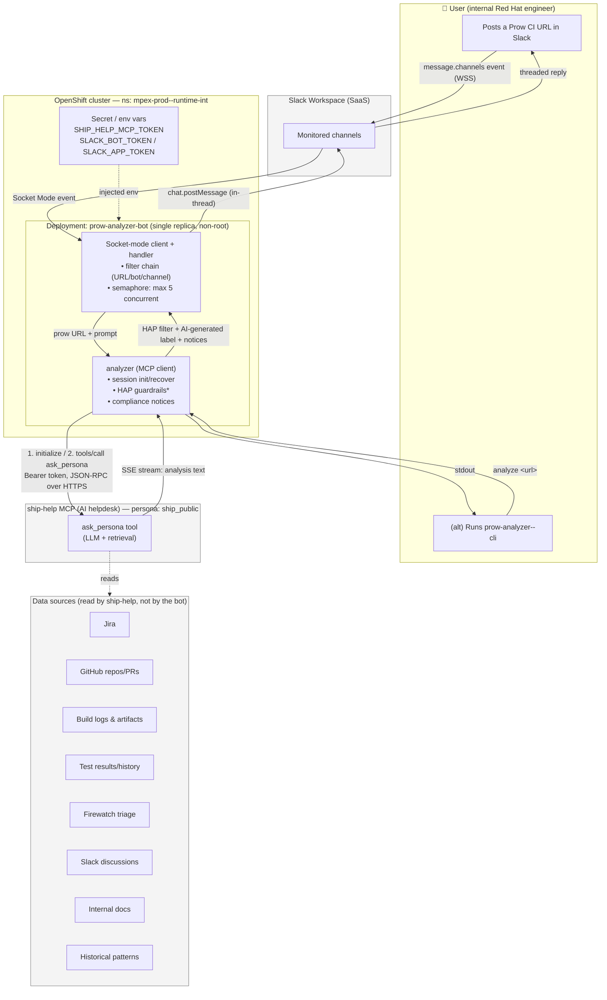
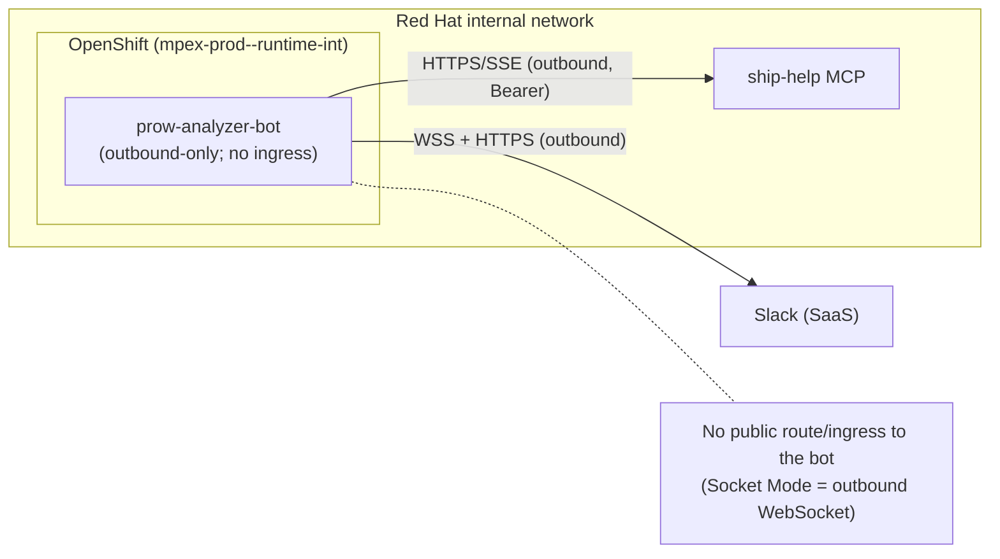

# Prow Analyzer -- Data Flow & Architecture Diagram

> System components, data flows, and the code/data repositories involved in the
> Prow Analyzer AI system. Diagrams use Mermaid (renders on GitHub). For deeper
> component detail see [architecture.md](architecture.md); for the full
> capability list see [capabilities-inventory.md](capabilities-inventory.md).

## 1. Component & Data-Flow Diagram



\* HAP guardrails (system-prompt preamble + output content filter) are **proposed
/ in progress** — see the status note in §5.

## 2. Request Sequence (happy path)

```mermaid
sequenceDiagram
    autonumber
    actor User
    participant Slack
    participant Bot as prow-analyzer-bot
    participant MCP as ship-help MCP (ship_public)
    participant Data as Data sources

    User->>Slack: Post message with Prow URL
    Slack-->>Bot: message.channels event (Socket Mode/WSS)
    Bot->>Bot: Ack immediately; filter (URL? not-bot? channel?); acquire semaphore
    Bot->>MCP: initialize (Bearer token) → Mcp-Session-Id
    Bot->>MCP: tools/call ask_persona { prompt + job URL }
    MCP->>Data: Retrieve across Jira/GitHub/logs/etc.
    Data-->>MCP: Context
    MCP-->>Bot: SSE stream → analysis text
    Bot->>Bot: HAP output filter + AI-generated label + disclaimer/review notice
    Bot->>Slack: chat.postMessage (in-thread reply)
    Slack-->>User: Threaded analysis
    Note over Bot,MCP: On "Session not found": invalidate + re-init + retry once
```

## 3. Trust / Network Boundaries



## 4. Code & Data Repositories / Stores

| Kind | Name / location | Role | Sensitive? |
|---|---|---|---|
| **Source code repo** | `github.com/RedHatQE/OpenShift-LP-QE--Tools` (module path); working copy also pushes to the `oharan2/OpenShift-LP-QE--Tools` remote | All agent code under `apps/prow-analyzer/` | No |
| **Container image repo** | `quay.io/chaclark/prow-analyzer-bot` (deployed tag: `debug-timing-2`) | Built runtime image (both bot + CLI binaries) | No (but do not bake secrets) |
| **Deployment manifests** | `apps/prow-analyzer/deploy/openshift/`, `deploy/slack/` | K8s resources + Slack app manifest | No |
| **Runtime config store** | Deployment **env vars** in ns `mpex-prod--runtime-int` (no ConfigMap present in prod) | `SHIP_HELP_MCP_URL`, `MONITORED_CHANNELS`, `PROMPT_TEMPLATE` | No |
| **Secrets store** | K8s Secret / env in ns `mpex-prod--runtime-int` | `SHIP_HELP_MCP_TOKEN`, `SLACK_BOT_TOKEN`, `SLACK_APP_TOKEN` | **Yes** |
| **Ephemeral state** | In-memory only (MCP session ID, semaphore) | No database; nothing persisted by the bot | No |
| **Logs** | Pod stdout (`oc logs`) | Timing + error + (proposed) HAP-redaction counts | Low; avoid logging payloads |
| **Backend data stores** | Inside **ship-help** (Jira, GitHub, logs, Firewatch, etc.) | Read by ship-help, **not** by the bot | Governed by ship-help |

**Key data-handling facts**
- The bot is **stateless**: it holds only an in-memory MCP session ID and a
  concurrency semaphore. It has **no database** and persists **no** analysis
  content.
- The bot has **no ingress**; all connections are outbound (Slack WSS + ship-help
  HTTPS/SSE).
- The bot never reads the backend data sources directly — it only receives
  ship-help's summarized text.

## 5. Status & accuracy notes

- **Persona:** production runs the **`ship_public`** persona (verified from the
  live deployment env), which differs from the `ocp_ai_helpdesk` default in the
  committed manifest.
- **Config source:** production sets values as **direct env vars** on the
  deployment; there is **no `prow-analyzer-config` ConfigMap** in
  `mpex-prod--runtime-int` (verified).
- **HAP guardrails** shown with an asterisk are **not yet in the deployed
  image** — they were in progress at the time of writing. Treat that node as
  "planned" until a rebuilt image is deployed.
- **Backend internals** (ship-help's model, retrieval, and its own data-store
  access controls) are **out of scope of this repo** and cannot be verified here;
  confirm with the ship-help team (`#ship-users`).
